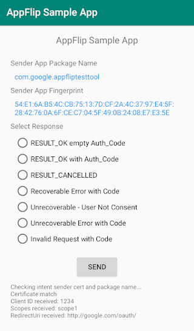

# App Flip Sample for Android

This sample app demonstrates an App Flip compatible account linking integration
on Android. You can use this app to verify how to respond to an incoming App Flip
intent from Google mobile apps.

The sample app is preconfigured to integrate with the
[App Flip Test Tool for Android](https://github.com/googlesamples/identity-appflip-tester-android),
which you can use to easily get started before you configure account linking
with Google.

## Screenshots

## Prerequisites

1. Android Studio installed (version 3.0 or above)
1. Android device or emulator (API 26 or above) with your target app installed

## Getting started

1. Import the project into Android Studio
1. Open `res/values/strings.xml` and edit the following values:
   - `calling_app_package_name`: Application id of the calling app
   - `calling_app_fingerprint`: SHA256 fingerprint of the calling app signature ([how do I find this?](https://developers.google.com/android/guides/client-auth))
1. Build and run the app on your target device

## License

Copyright 2019 Google LLC

Licensed under the Apache License, Version 2.0 (the "License");
you may not use this file except in compliance with the License.
You may obtain a copy of the License at

    http://www.apache.org/licenses/LICENSE-2.0

Unless required by applicable law or agreed to in writing, software
distributed under the License is distributed on an "AS IS" BASIS,
WITHOUT WARRANTIES OR CONDITIONS OF ANY KIND, either express or implied.
See the License for the specific language governing permissions and
limitations under the License.
